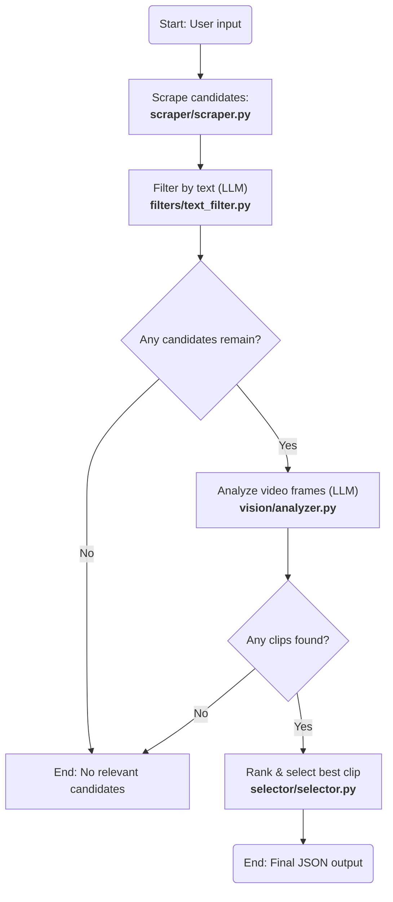

# Design Note: AI-Powered Twitter Clip Finder

This document outlines the architectural and strategic decisions made during the development of the AI-Powered Twitter Clip Finder, as required by the technical trial.

## 1. Overall Strategy & Architecture

The core strategy was to build a multi-stage, sequential pipeline that progressively filters a large pool of potential videos down to a single, precise clip. This "funnel" approach ensures efficiency by using cheap, fast filters first and reserving the most expensive operations (video download and AI vision analysis) for only the most promising candidates.

The architecture is built around a LangGraph state machine (`src/graph.py`), which acts as the central orchestrator. This choice was deliberate for several key reasons:

- **Modularity:** Each step in the pipeline (scraping, filtering, vision, selection) is a self-contained "node" in the graph. This makes the logic easy to understand, test, and modify independently.
- **State Management:** LangGraph provides a clear and explicit way to manage the application's state (`GraphState`) as it passes from one node to the next.
- **Resilience:** Conditional edges enable the graph to terminate gracefully if a step fails or yields no results (e.g., no candidates are found after filtering), thereby preventing the entire application from crashing.

The project is structured as a standard Python package within the `src/` directory, with all modules using relative imports. This makes the codebase self-contained and portable.

## 2. Candidate Filtering Strategy

The filtering process is the most critical part of the application's efficiency strategy. It's a two-stage process:

### Stage 1: Text-Based Filtering (`filters/text_filter.py`)

- **Goal:** To quickly eliminate the vast majority of irrelevant tweets before any video is downloaded.
- **Method:** The text content of all scraped tweets is sent in a single, batched call to a Gemini language model. The model is instructed (via `prompts/text_filter_prompt.txt`) to act as an intelligent filter and assign a relevance score (0.0 to 1.0) to each tweet based on the user's description.
- **Efficiency:** This is highly efficient. A single API call can evaluate dozens of candidates, thereby avoiding the significant I/O and processing costs associated with downloading and analyzing videos. Only tweets that pass a confidence threshold (e.g., > 0.5) proceed to the next stage.

### Stage 2: Vision-Based Analysis (`vision/analyzer.py`)

- **Goal:** To analyze the video content of the shortlisted candidates to find the exact clip.
- **Method:** For each remaining candidate, the video is downloaded, and frames are extracted at a fixed interval (2 seconds). These frames are then sent to the Gemini Vision model. The prompt (`prompts/vision_analyzer_prompt.txt`) instructs the model to identify continuous segments that match the description and desired duration.
- **Accuracy:** By analyzing the visual content directly, this stage provides a high degree of accuracy in confirming the relevance of the video and identifying the precise start and end times of the desired clip.

## 3. Minimizing Expensive Calls

Minimizing expensive operations (LLM calls and video I/O) was a primary design consideration.

- **Aggressive Text Filtering:** As described above, the text filter is the most critical optimization. It ensures that the expensive vision_node only ever runs on a small, highly relevant subset of the initial scraped data.
- **Batched Operations:** The text filtering step sends all candidates to the LLM in a single call, which is more efficient than making individual calls for each tweet.
- **No Unnecessary Downloads:** Videos are only downloaded after they have passed the text-filtering stage.
- **Frame Extraction Interval:** Frames are extracted every 2 seconds, not every frame. This provides the vision model with enough context to understand the video's content without overwhelming it with thousands of redundant images, which would increase token usage and cost.

## 4. Final Clip Selection Logic

The final selection logic (`selector/selector.py`) is straightforward and deterministic:

- **Aggregation:** The system first gathers all `ClipFindings` from all the videos that were analyzed. One video can yield multiple potential clips.
- **Ranking:** All findings are placed into a single list and sorted in descending order based on the `confidence` score assigned by the Gemini Vision model.
- **Selection:**
  - The clip with the highest confidence score is chosen as the primary result.
  - The following one or two clips in the sorted list are selected as `alternates`.
- **Formatting:** The final `FinalResult` object is constructed, including the data for the best clip, the alternates, and the `trace` information gathered throughout the pipeline's execution.

This ensures that the user is always presented with the clip that the AI model was most confident about, while also providing fallback options in case the initial prediction is incorrect.
